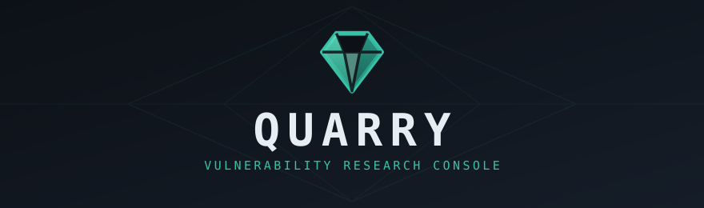

<div align="center">



<br>

[](https://api.hackerone.com/)

 &nbsp;
 &nbsp;
[](https://github.com/swisskyrepo/PayloadsAllTheThings) &nbsp;


[](https://github.com/skraft9) &nbsp;
[](https://claude.com/claude-code) &nbsp;


`Python` &nbsp;&middot;&nbsp; `JavaScript` &nbsp;&middot;&nbsp; `CSS` &nbsp;&middot;&nbsp; `Docker` &nbsp;&middot;&nbsp; `SQLite` &nbsp;&middot;&nbsp; `Apache-2.0`

</div>


---


---


---


---

##  Supported Bug Bounty Platforms

- **HackerOne**

Quarry syncs and submits through the HackerOne API. Other platforms are not supported yet.


##  Key Features

- **Your entire hunt on one board.** Sync every report, program, bounty and triage thread from the
  HackerOne API, so the console mirrors your real hunting instead of a spreadsheet you patch by hand.
- **Find it, draft it, submit it.** File a finished report using the HackerOne API, then watch
  its state and bounty flow straight back into the Tracker.
- **A researcher's arsenal, built in.** Full-text search across every lead, report and payload, a
  payload library cloned from PayloadsAllTheThings, and live CVE/CVSS advisory feeds cross-referenced
  against your work.
- **Native to agentic AI.** Every lead, note and payload is plain Markdown on disk, so Claude Code,
  Cursor or your own agent can read, query and draft your research right alongside you.


##  Quick Start

```bash
# Clone the repository to your machine
git clone https://github.com/skraft9/quarry-vrc.git quarry && cd quarry

# Copy the example environment file (then set QUARRY_ADMIN_PASSWORD; QUARRY_ALLOWLIST is optional)
cp .env.example .env
$EDITOR .env

# Build the image and start the container
docker compose up -d
```

- Quarry runs as a single container; the code is baked into the image.
- Database, leads and payloads live on Docker-managed volumes, so `docker compose pull`
  upgrades the app without touching your data.
- First boot generates a config, a self-signed TLS certificate and an empty database, then prints
  the URL.
- Open the printed URL, sign in, and connect your HackerOne account in **Integrations**.
- Full walkthrough in [`docs/SETUP.md`](docs/SETUP.md).

### Usage

Most of this happens through the UI, but the same operations run on the CLI inside the container
(`docker compose exec quarry python3 ...`):

```bash
# Sync your reports, bounties, states and triage threads from HackerOne
python3 core/h1.py --sync

# Sync each program's guidelines, scopes and visibility
python3 core/h1.py --sync-programs

# Submit a finished report (prints the payload; add --confirm to actually send it)
python3 core/h1.py --submit reports/<slug>.md --program <handle> \
  --weakness cwe-79 --scope "<in-scope asset>" --severity high

# Rebuild the lead and report index from your workspace Markdown
python3 core/ingest.py --rebuild

# Refresh the advisory feeds, and search the payload library
python3 core/advisories.py --sync
python3 core/payloads.py --search "jwt none"
```

### Updating

```bash
docker compose pull       # fetch the new image
docker compose up -d      # recreate the container on it
```

- Your database, leads, config and credentials live on Docker volumes, so upgrading is a
  pull-and-recreate that never touches your data.
- To pin a specific release instead of tracking the latest, set the image tag in
  `docker-compose.yml` (for example `image: ghcr.io/skraft9/quarry-vrc:v1.0.0`); every version is
  tagged on the [Releases](https://github.com/skraft9/quarry-vrc/releases) page.

### Requirements

| Requirement | Needed for |
|---|---|
| **Docker** (with Compose) | Running Quarry. It is the only thing you install. |
| **A HackerOne API token** | Optional, but the point: it populates the Tracker and enables one-click submit. Paste it in the app. |

Inside the image, Quarry is the **Python 3.12 standard library and one HTML page** - `sqlite3` with
FTS5, `ssl`, `http.server`, `hashlib`. It runs without a framework, a build step or a package
manager. That is a deliberate security decision: a console holding your unreported findings and a
bounty credential carries **zero third-party runtime code** to audit, pin, or be compromised
through. (`git` and `curl` ship only so the payload library can clone its reference and the
container can health-check itself; neither is a language dependency.)

### The `.env` File

| Variable | Meaning |
|---|---|
| `QUARRY_ADMIN_PASSWORD` | **Required.** Creates the first admin login on first boot; the server refuses to start without it. |
| `QUARRY_ADMIN_USER` | The first admin's username. Default `admin`. |
| `QUARRY_APP_NAME` | Display name in the top-left brand and the page title. |
| `QUARRY_PORT` | Host port the HTTPS console is published on. Default `8443`. |
| `QUARRY_ALLOWLIST` | **Client IP allow-list**, checked before auth on every request. Comma-separated IPs/CIDRs. Empty = open, which is fine for a host only you can reach. |
| `QUARRY_TLS_MODE` | `self-signed` (default) generates a local CA + cert on first boot; `mounted` uses a cert/key you mount into the data volume. |


##  Core Capabilities

| Tab | What it does |
|---|---|
| **Dashboard** | Shows what you earned, what moved, and what is still open. |
| **Leads** | Tracks your hunt notes from disk through a status workflow: open, confirmed, ready, submitted, awarded, parked, killed. |
| **Tracker** | Lists every HackerOne report with state, bounty, CWE, impact, program, target and payout split. |
| **Programs** | Holds your programs with their scope and rules of engagement; totals awards, average payout and earned. |
| **Targets** | Maps in-scope assets from HackerOne to the local workspaces your leads are filed against. |
| **Advisories** | Ingests any RSS/Atom vulnerability feed you configure (CISA, VulDB, or a vendor's) and cross-references it. |
| **Payloads** | Searches a payload library (one row per documented block), cloned from a public reference and yours to extend. |
| **Files** | Browses the configured roots with an edit-and-save-back pane; denied paths are shown, not hidden. |
| **Certificates** | How to trust the container's TLS cert. Reached from the seal icon beside the version in the sidebar footer. |
| **Integrations** / **Tokens** | Store your HackerOne credentials write-only; issue Bearer tokens for non-browser clients. |
| **Audit log** / **Status** / **Settings** | Record what happened, report health and the index, and change job cadence. |

###  Built for Agentic AI

Quarry is built to pair with an agentic AI - Claude Code, Cursor, or a custom local agent - working
alongside you at the console:

- **Your research is plain Markdown on disk.** Leads, RCAs and notes are files in your workspace
  volume, so an agent can **inspect, query, write and refine** them directly - summarizing a lead,
  drafting a report into your workspace, or reworking a finding - with no API wrappers and no
  lock-in. The app just indexes what the agent (or you) writes.
- **The whole corpus is queryable.** SQLite FTS5 full-text search spans leads, reports and payloads,
  so an agent can pull exactly the context it needs instead of re-reading everything.
- **Programmatic access is first-class.** Server-side **Bearer tokens** let external scripts and AI
  tools query the console over its API - read the Tracker, fetch a lead, check a program's scope -
  without a browser session.

In summary, Quarry is the memory and context engine, and your agent is the pair. Everything stays on
your box. See [`docs/AGENTS.md`](docs/AGENTS.md) for the full agent guide on how to record a lead the
app will index, query the console over the API, and ship a report to HackerOne.


##  HackerOne Integration

Quarry talks to the HackerOne API directly, so the console reflects your real hunting instead of a
copy you keep in step by hand.

- **Sync** pulls your programs, scopes, reports, states, bounties, payout splits and triage threads.
- **Submit** files a finished report to a program straight from the app, with no copy-paste into the
  web form.
- **Read the triage** fetches the analyst's actual comment on a closed report, where the reopen
  condition usually lives.

Your API username and token are pasted once in **Integrations**, verified against the live API before
they are stored, kept server-side, and never rendered back into the page.

### Systems of Record

Every entity has exactly one authority, and it is never the database. The SQLite index is a cache
and a query layer; it holds no entity it is the authority for.

| Entity | Authority | Rebuilt from |
|---|---|---|
| Reports, bounties, payout splits | **HackerOne API** | `h1.py --sync` |
| Program guidelines, scopes | **HackerOne API** | `h1.py --sync-programs` |
| Leads, RCAs, follow-ups | **Markdown in your workspace volume** | `ingest.py --rebuild` |
| Payloads | **A git clone on disk**, never vendored | `scripts/sync-payloads.sh` |

- Storing leads as Markdown on disk is what lets an AI agent read, summarize and draft reports
  directly in your workspace context.
- Because HackerOne owns your reports, a rebuild never invents or overwrites them.
- Anticipated money is held separately and never summed into the total, so a hand-typed figure can
  never turn an expectation into a confirmed award.
- One container, all mutable state on named volumes; details in
  [`docs/ARCHITECTURE.md`](docs/ARCHITECTURE.md).


##  Security Model

Quarry holds your unpublished findings and a bounty API credential. It is built to run on **your own
machine or a private host you control**, and is not hardened for the public internet.

| Control | Detail |
|---|---|
| **Zero-dependency runtime** | Python standard library only, so there is zero third-party runtime code to audit or be compromised through. |
| **IP allow-list, first** | `QUARRY_ALLOWLIST` is checked before authentication and routing; an unlisted address gets 403 and nothing else. |
| **TLS always** | Self-signed local CA on first boot, or bring your own. |
| **PBKDF2-HMAC-SHA256** | 600,000 iterations, per-user salt, constant-time verify; login failures are rate-limited per source. |
| **Hashed credentials** | Sessions and API tokens are stored as SHA-256, so a database read yields nothing usable. |
| **Write-only secrets** | Your HackerOne token is stored server-side and never returned by any endpoint. |
| **Strict CSP** | `default-src 'none'` blocks inline handlers, remote scripts and remote fonts. The markdown renderer escapes at the boundary and a test suite attacks it. |


##  Contributing

Two long-lived branches, and every change goes through a pull request so it stays reviewable and
revertable.

- **`dev`** is the staging branch - work lands here first.
- **`main`** is what ships; `dev` merges into it as a **release**, cut on the GitHub
  [Releases](https://github.com/skraft9/quarry-vrc/releases) page with a version tag and notes.

```bash
git checkout dev && git pull
git checkout -b fix/short-description
# work, then open a PR into dev (not main):
gh pr create --base dev --fill
```

House rules:

- Branch names `fix/`, `feat/`, `docs/`; prefix the PR title `feat:` or `fix:`.
- Both test suites green before a PR.
- Never commit a secret (`.gitignore` covers the known ones).
- ASCII punctuation only.
- Versions run on the `1.x` line and move up.
- New features increment up 1.x.0
- New fixes increments up 1.0.x


<div align="center">

Made for hunters and their agents.  [Apache-2.0](LICENSE)

</div>
